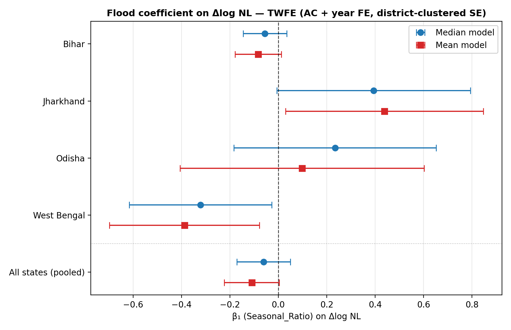
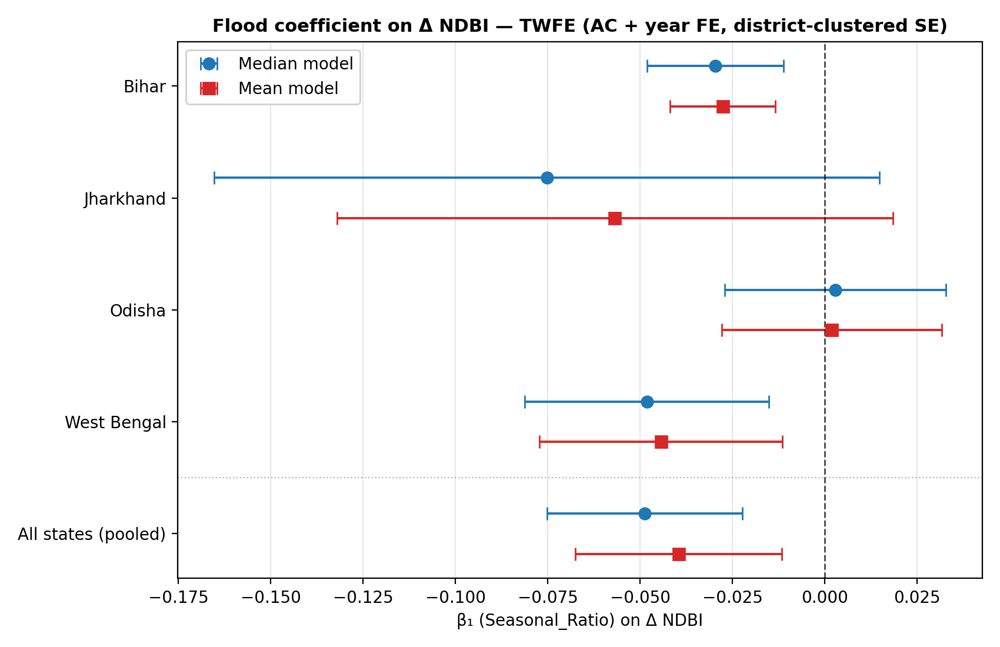
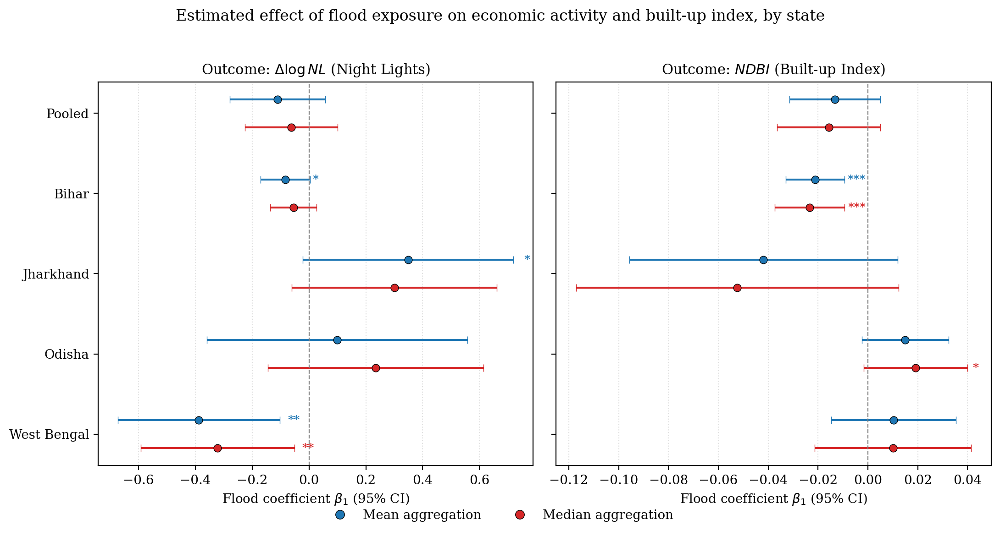

# Flood Exposure and Economic Activity in Eastern India

[](https://flood-insights-india.streamlit.app)

Panel regression analysis of how seasonal flood exposure affects economic activity and built-up infrastructure across Assembly Constituencies (ACs) in Bihar, Jharkhand, Odisha, and West Bengal, 2014–2019.

---

## Overview

This project estimates the causal effect of flood exposure on two outcomes:

- **Night-lights intensity** (Δlog NL): proxy for local economic activity
- **Built-up index change** (ΔNDBI): proxy for physical infrastructure

The identification strategy uses two-way fixed effects (TWFE) — AC fixed effects absorb time-invariant local characteristics; year fixed effects absorb common shocks. Standard errors are clustered at the district level.

---

## Quick Start

```bash
git clone https://github.com/shreya12836/flood-economic-impact-eastern-india.git
cd flood-economic-impact-eastern-india
pip install -r requirements.txt

# Run primary regressions (OLS with two-way FE)
python src/regression/run_nl_ols_pooled.py
python src/regression/run_ndbi_ols_pooled.py

# Launch dashboard
streamlit run dashboard/app.py
```

---

## Data Sources

| Source | Variable | Resolution |
|---|---|---|
| JRC Global Surface Water (GSW) | Seasonal_Ratio, Permanent_Ratio | 30 m |
| VIIRS/DMSP Nighttime Lights | NL_mean, NL_median | ~500 m |
| Landsat-8 SR (OLI bands 4, 5, 6) | NDVI, NDBI | 30 m |
| MODIS MCD12Q1 Land Cover (IGBP Type 1) | LC_X_ratio (land cover shares) | 500 m |
| Election Commission of India | AC boundaries (2008 delimitation) | Vector |

Raster data were aggregated to AC boundaries using QGIS zonal statistics. Processed CSV files are one row per AC per year.

Full variable definitions and index formulas: [docs/data_dictionary.md](docs/data_dictionary.md)

---

## Regression Specifications

**Primary estimator:** OLS with two-way fixed effects via `pyfixest.feols`. Ordinary least squares is used throughout; AC and year fixed effects are absorbed into the estimator (`| AC_UID + YEAR`) rather than partialled out manually. `linearmodels.PanelOLS` cross-check scripts confirm coefficient stability across packages.

**Equation 1 — Night-lights (economic activity)**

```
Δlog(NL_it) = β₁ · Seasonal_Ratio_it + β₂ · NDVI_{i,t−1} + β₃ · NDBI_{i,t−1} + αᵢ + γₜ + εᵢₜ
```

Estimated via OLS with two-way fixed effects (`pyfixest.feols`, `| AC_UID + YEAR`); SEs clustered by district.

**Equation 2 — NDBI (built-up infrastructure)**

```
ΔNDBI_it = β₀ + β₁ · Seasonal_Ratio_it + β₂ · NDVI_{i,t−1} + β₃ · NL_{i,t−1} + αᵢ + γₜ + εᵢₜ
```

Estimated via OLS with two-way fixed effects (`pyfixest.feols`, `| AC_UID + YEAR`); SEs clustered by district. A `linearmodels.PanelOLS` cross-check is available in `run_ndbi_pooled.py`.

NDBI is used in levels (not log) because it is bounded in [−1, 1] and frequently negative in rural constituencies.

---

## Key Insights

- **West Bengal — Night-lights:** A one-unit increase in `Seasonal_Ratio` is associated with 32–39% lower NL growth (β = −0.32 to −0.39, p < 0.05).
- **Bihar — Infrastructure:** Higher flood exposure predicts a significant decline in built-up index growth (β = −0.02 to −0.03 on ΔNDBI, p < 0.01).
- **Pooled sample:** No significant effect across all four states — state-level effects are heterogeneous and partially cancel out.
- **Robustness:** `linearmodels.PanelOLS` cross-checks return identical coefficients to the primary pyfixest estimates.

---

## Supporting Evidence

**West Bengal — Night-lights**
Higher flood exposure (Seasonal_Ratio) is associated with a statistically significant reduction in night-lights growth. The coefficient on Seasonal_Ratio ranges from −0.32 to −0.39 (p < 0.05) depending on the NL measure (mean vs. median). This implies that a one-unit increase in the seasonal flood water fraction is associated with a 32–39 percent reduction in economic activity growth.



**Bihar — NDBI**
Flood exposure predicts a significant decline in built-up index growth in Bihar. The coefficient on Seasonal_Ratio is −0.02 to −0.03 (p < 0.01), suggesting flood-affected constituencies see slower infrastructure accumulation.



**Pooled sample**
No statistically significant effect is detected in pooled regressions. The pooled null reflects heterogeneous and partially cancelling state effects — not an absence of impact.



---

## Panel Structure

- **Unit of observation:** Assembly Constituency (AC)
- **States:** Bihar, Jharkhand, Odisha, West Bengal
- **Raw panel:** 765 ACs × 6 years (2014–2019) = 4,674 observations
- **Estimation sample:** ~3,890 observations (2014 dropped for lag construction; a small number of ACs dropped due to missing satellite coverage)
- **Clusters:** 108 districts

---

## Repository Structure

```
flood-economic-impact-eastern-india/
├── data/
│   ├── processed/          # State-year AC-level CSVs + merged panel
│   └── README.md           # Column definitions and data provenance
├── src/
│   ├── regression/         # Primary OLS (pyfixest) + linearmodels cross-check scripts
│   └── visualization/      # Coefficient plots and trend figures
├── scripts/                # Paper-ready table builders
├── outputs/
│   ├── figures/            # PNG coefficient and trend plots
│   └── tables/             # Regression result Excel files
├── docs/
│   ├── methodology.md      # Estimation details and data cleaning decisions
│   ├── data_dictionary.md  # Variable definitions
│   └── roadmap.md          # Planned extensions
├── .github/workflows/      # CI: dependency install and syntax check
├── requirements.txt
└── README.md
```

---

## Limitations

- **Outcome proxy:** Night-lights measure commercial and industrial activity but miss subsistence agriculture, which is the dominant livelihood in flood-prone Bihar and Odisha constituencies.
- **Flood measure:** `Seasonal_Ratio` captures inundation extent from satellite imagery but not flood depth, duration, or damage severity. Two constituencies with the same ratio may experience very different economic disruption.
- **Parallel trends:** The TWFE estimator requires that treated and control ACs would have followed parallel outcome trends in the absence of flooding. This assumption is untestable and may be violated if flood-prone ACs are structurally different in ways that interact with the outcome trend.
- **Missing regressor:** Road density is not yet included in the model. If road access correlates with both flood exposure and economic recovery capacity, current estimates may carry omitted variable bias.
- **Estimation window:** 2014 is excluded from estimation for lag construction; results cover 2015–2019 only.
- **Pooled null:** The pooled null result is not evidence of no effect. It reflects cancellation across states with heterogeneous and opposite-sign effects, not a true zero treatment effect.
- **Spatial resolution mismatch:** VIIRS nighttime lights at ~500 m are considerably coarser than the 30 m Landsat and JRC GSW layers. Aggregation to AC-level averages partially mitigates this but introduces measurement error in the outcome variable.

---

## Status & Planned Extensions

**Publication status:** This repository contains the analysis for an ongoing thesis manuscript. Results and interpretations are preliminary and subject to change pending peer review.

**Repository:** [shreya12836/flood-economic-impact-eastern-india](https://github.com/shreya12836/flood-economic-impact-eastern-india)

**Planned extension:** Constituency-level road density data from [GeoSadak](https://geosadak.com) will be incorporated as an infrastructure-accessibility control to address the omitted variable bias flagged in Limitations. See [`docs/roadmap.md`](docs/roadmap.md) for details.

---

## How to Run

```bash
# 1. Install dependencies
pip install -r requirements.txt

# 2. Primary regressions — OLS with two-way FE (shown in dashboard)
python src/regression/run_nl_ols_pooled.py
python src/regression/run_nl_ols_by_state.py
python src/regression/run_ndbi_ols_pooled.py
python src/regression/run_ndbi_ols_by_state.py

# 3. Robustness cross-checks — linearmodels PanelOLS
python src/regression/run_nl_twfe_pooled.py
python src/regression/run_nl_twfe_by_state.py
python src/regression/run_ndbi_pooled.py
python src/regression/run_ndbi_by_state.py

# 4. Generate plots
python src/visualization/generate_ols_plots.py

# 5. Build paper tables
python scripts/build_paper_table.py
python scripts/build_paper_table_ndbi.py
```

All outputs are written to `outputs/figures/` and `outputs/tables/`.

---

## Requirements

Python 3.11.9. See `requirements.txt` for pinned package versions.
